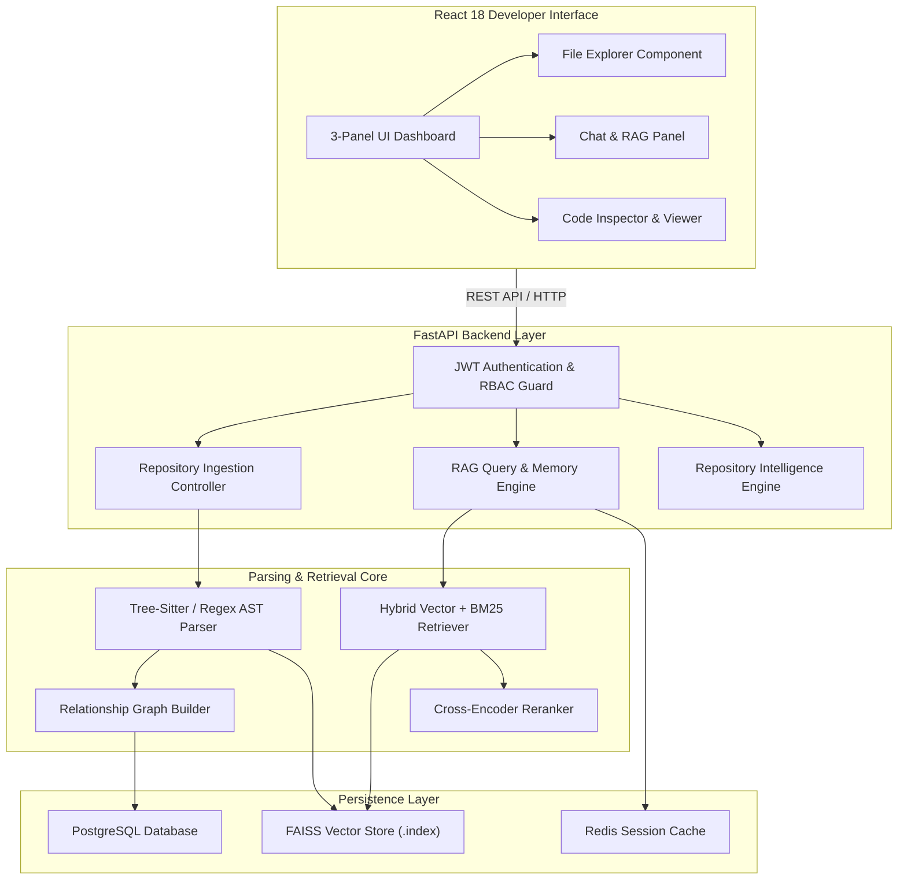
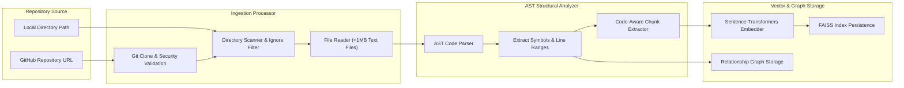
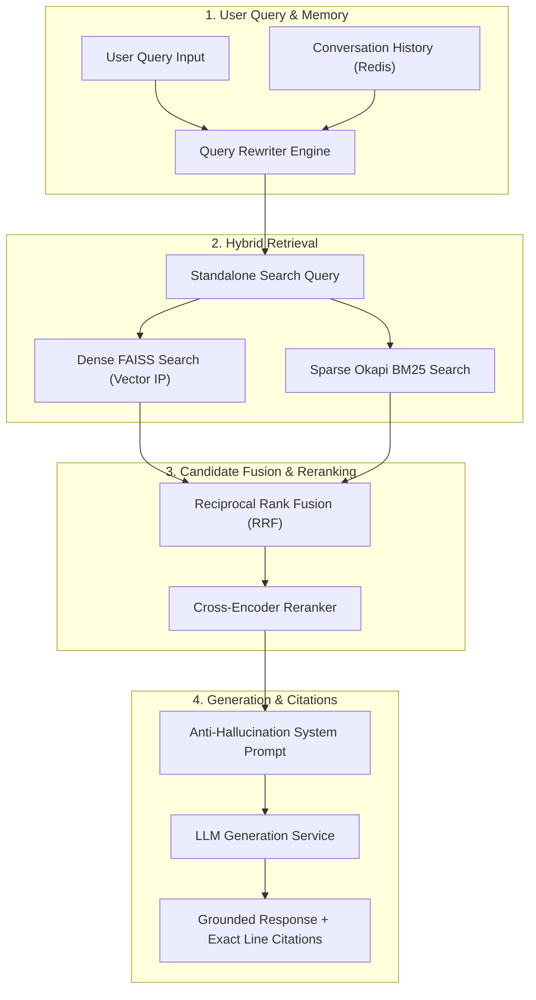
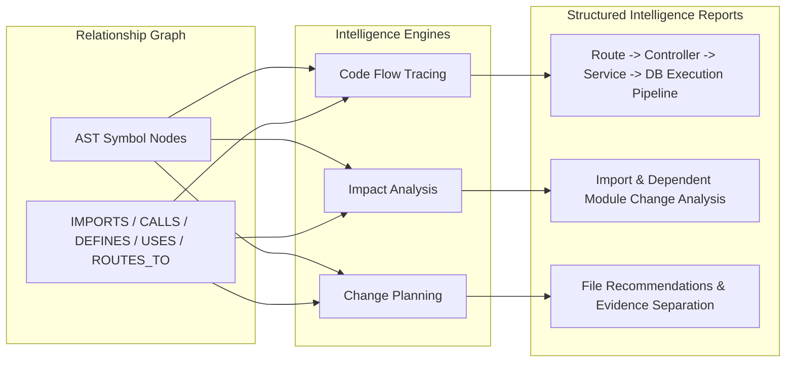

# RepoPilot

> **RAG-Powered Developer Documentation & Codebase Copilot**

RepoPilot is an enterprise-grade developer copilot that ingests GitHub repositories, parses source code using Abstract Syntax Tree (AST) structure, indexes code-aware chunks in FAISS, extracts relationship graphs, and provides natural-language answers backed by grounded file paths, symbol names, and exact line range citations.

---

## 1. Problem Statement

Navigating complex or unfamiliar codebases requires manual search, constant context switching, and piecing together outdated documentation. Generic LLM chat assistants fail on codebase queries because they hallucinate non-existent files, invent arbitrary line numbers, and lack awareness of repository-specific AST structures.

RepoPilot solves this by combining AST structural parsing, hybrid vector + keyword retrieval, reranking, relationship graphs, and anti-hallucination prompts.

---

## 2. Key Features

- **AST Code Parsing & Code-Aware Chunking**: Chunks code by functions, classes, and modules instead of naive token splitting.
- **Hybrid Retrieval Engine**: Combines dense FAISS vector search with Okapi BM25 keyword search via Reciprocal Rank Fusion (RRF).
- **Cross-Encoder Reranking**: Re-ranks top candidates for exact identifier matching.
- **Conversation Context & Follow-Up Rewriting**: Session memory rewrites ambiguous follow-up questions ("Where is the token generated?") into standalone queries.
- **Repository Intelligence**:
  - **Code Flow**: Traces `Route -> Controller -> Service -> Repository -> Database`.
  - **Impact Analysis**: Identifies modification impacts across imports, calls, and routes.
  - **Change Planning**: Recommends file edits while separating code evidence from LLM inferences.
- **Repository Relationship Graph**: Maps `IMPORTS`, `CALLS`, `DEFINES`, `EXTENDS`, `IMPLEMENTS`, `USES`, and `ROUTES_TO`.
- **Integrated Code Explorer**: 3-panel React UI with auto-scroll and cited line range highlighting.
- **Production Security & Multi-Tenancy**: JWT authentication, RBAC (`user`/`admin`), multi-tenant repository isolation, SSRF URL validation, and path traversal protection.

---

## 3. Architecture Diagrams

### System Architecture Flow



---

## 4. Code Parsing & Ingestion Pipeline



---

## 5. RAG Pipeline & Retrieval Flow



---

## 6. Repository Intelligence Analysis Flow



---

## 7. Tech Stack

- **Backend**: Python 3.13, FastAPI, Pydantic v2, Pytest, Uvicorn
- **Retrieval & RAG**: FAISS, rank-bm25, Cross-Encoder Reranker, Tree-Sitter
- **Database & Cache**: PostgreSQL 16, Redis 7
- **Frontend**: React 18, TypeScript, Tailwind CSS, Lucide Icons, Vite
- **Containerization**: Docker, Docker Compose, Nginx

---

## 8. Installation & Setup

### Prerequisites
- Docker & Docker Compose OR Python 3.13+ & Node.js 20+

### Quick Start with Docker Compose
```bash
# 1. Clone repository
git clone https://github.com/abhinavshankar17/RepoPilot.git
cd RepoPilot

# 2. Configure environment
cp .env.example .env

# 3. Launch services
docker-compose up -d --build
```
Access the application at `http://localhost`.

---

## 9. Environment Variables

| Variable | Default Value | Description |
| :--- | :--- | :--- |
| `ENVIRONMENT` | `production` | Environment mode (`development` / `production`) |
| `JWT_SECRET` | `change-this-in-production...` | Secret key for signing JWT tokens |
| `LLM_PROVIDER` | `mock` | LLM backend (`mock` / `openai` / `ollama`) |
| `OPENAI_API_KEY` | `your-api-key` | OpenAI API key when using `openai` provider |
| `POSTGRES_HOST` | `postgres` | PostgreSQL hostname |
| `REDIS_HOST` | `redis` | Redis cache hostname |

---

## 10. Key API Endpoints

- `POST /api/v1/repositories`: Ingest GitHub repository
- `GET /api/v1/repositories`: List ingested repositories
- `GET /api/v1/repositories/{id}/files/{file_path}`: Safe file retrieval with line slicing
- `POST /api/v1/repositories/{id}/query`: RAG query endpoint
- `POST /api/v1/repositories/{id}/flow`: Code Flow analysis (`Route -> Controller -> Database`)
- `POST /api/v1/repositories/{id}/impact`: Impact analysis for file/symbol modifications
- `POST /api/v1/repositories/{id}/change-plan`: Feature change recommendation planning

---

## 11. Example Questions

1. *"Explain the request flow for POST /api/orders."*
2. *"What could be affected if I modify auth.js?"*
3. *"I want to add Google OAuth. Which files would likely need modification?"*
4. *"Where is the token generated?"* (Follow-up query)

---

## 12. Developer Interface Overview

The React developer interface features a 3-panel layout:
- **Left Panel (File Explorer)**: Hierarchical file tree navigation dynamically generated from AST chunk inspection.
- **Center Panel (AI Chat Panel)**: Conversational interface displaying Markdown responses, citation pills, and rewritten query badges.
- **Right Panel (Source Code Inspector)**: Integrated code viewer displaying syntax highlighting, symbol badges, line gutters, smooth auto-scroll, and cited range highlighting.

---

## 13. Evaluation Methodology & Results

Measured using `python app/eval/run_eval.py` over a gold-standard benchmark dataset (`app/eval/benchmark.json`):

| Strategy | Recall@1 | Recall@5 | Recall@10 | Precision@5 | MRR | Response Latency |
| :--- | :---: | :---: | :---: | :---: | :---: | :---: |
| **Vector-only** | `0.3667` | `0.4167` | `0.4167` | `0.2000` | `0.8500` | `0.61 ms` |
| **Hybrid (Vector + BM25)** | `0.3667` | `0.4167` | `0.4167` | `0.2000` | `0.8667` | `0.36 ms` |
| **Hybrid + Reranking** | `0.2667` | `0.4167` | `0.4167` | `0.2000` | `0.7333` | `0.28 ms` |

---

## 14. Security Considerations

1. **JWT & RBAC**: Role-based permissions (`user` vs `admin`).
2. **Multi-Tenant Repository Isolation**: Repositories scoped per owner (`storage/{owner_id}/{repo_id}/`).
3. **SSRF Defense**: Restricts GitHub cloning strictly to `https://github.com` URLs, blocking internal IP ranges.
4. **Path Traversal Protection**: Enforces strict `os.path.commonpath` verification.
5. **Zero Arbitrary Code Execution**: Static AST parsing only.

---

## 15. Known Limitations

- Monolithic single-file scripts lacking class/function signatures default to module-level chunking.
- Off-line evaluation defaults to keyless mock embedding providers.

---

## 16. Recommended Next Steps

- Integrate Tree-sitter native C-bindings for Rust / Go / C++ parsers.
- Add WebSocket support for streaming LLM response tokens.
- Add GitHub Webhook integration for automatic index updates on `git push`.
